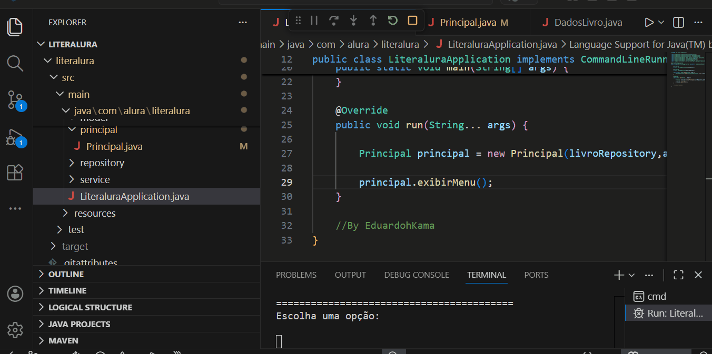

# 📚 LiterAlura - Catálogo de Livros

Projeto desenvolvido em Java utilizando Spring Boot que permite consultar livros da API Gutendex, armazenar informações em um banco de dados relacional e realizar consultas através de um menu interativo no terminal.

---

# 📖 Descrição

O **LiterAlura** é um catálogo de livros que consome dados da API Gutendex (baseada no Project Gutenberg) e permite armazenar e consultar informações sobre livros e autores.

O sistema funciona através de um menu interativo no terminal onde o utilizador pode buscar livros, visualizar autores e obter estatísticas sobre os livros cadastrados.

---

# 🚀 Tecnologias Utilizadas

- Java 21
- Spring Boot
- Spring Data JPA
- PostgreSQL
- Maven
- Jackson (JSON Parser)
- HttpClient

API utilizada:

Gutendex (Project Gutenberg)

https://gutendex.com/

---

# 📊 Funcionalidades

O sistema possui um menu interativo com as seguintes opções:

1. Buscar livro por título
2. Listar todos os livros cadastrados
3. Listar livros por idioma
4. Listar autores cadastrados
5. Listar autores vivos em determinado ano
6. Estatísticas de livros por idioma

---

# 🗂 Estrutura do Projeto

src/main/java
│
├── model
│ ├── Livro.java
│ └── Autor.java
│
├── repository
│ ├── LivroRepository.java
│ └── AutorRepository.java
│
├── dto
│ ├── DadosLivro.java
│ ├── DadosAutor.java
│ └── DadosResultado.java
│
├── service
│ ├── ConsumoApi.java
│ └── ConverteDados.java
│
├── principal
│ └── Principal.java

---

# ⚙️ Configuração do Projeto

### 1 - Clonar o repositório
git clone https://github.com/seuusuario/literalura.git

### 2 - Configurar banco de dados

Criar banco PostgreSQL:
CREATE DATABASE literalura;

Editar o arquivo:
application.properties

spring.datasource.url=jdbc:postgresql://localhost:5432/literalura
spring.datasource.username=postgres
spring.datasource.password=sua_senha

spring.jpa.hibernate.ddl-auto=update

---

# ▶️ Executando o Projeto

Rodar a aplicação:
mvn spring-boot:run

Menu exibido:

=============== LITERALURA ===============

1 - Buscar livro por título
2 - Listar todos os livros
3 - Listar livros por idioma
4 - Listar autores
5 - Autores vivos em determinado ano
6 - Estatísticas de idiomas

0 - Sair

---

## Demonstração

---

# 👨‍💻 Autor

Projeto desenvolvido por:

Kama Eduardo
